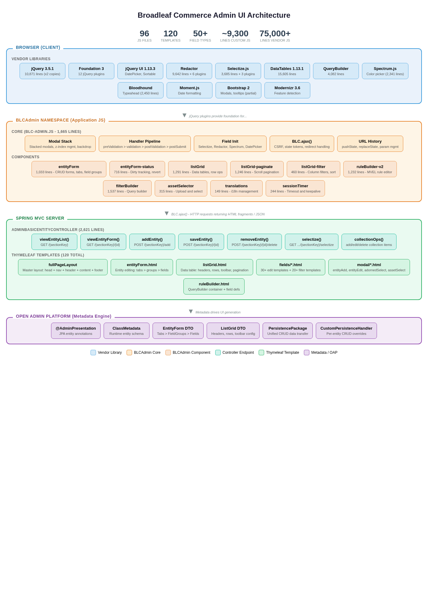

# Broadleaf Commerce Admin UI Architecture

> **Document Version:** 1.0  
> **Date:** April 2026  
> **Purpose:** Comprehensive audit of the current admin UI architecture to guide future rewrite efforts.  
> **Scope:** Open Admin Platform front-end — JavaScript, templates, CSS, and their server-side integration points.

---

## Table of Contents

1. [Executive Summary](#1-executive-summary)
2. [Technology Stack](#2-technology-stack)
3. [High-Level Architecture](#3-high-level-architecture)
4. [JavaScript Component Inventory](#4-javascript-component-inventory)
   - 4.1 [Script Loading Order](#41-script-loading-order)
   - 4.2 [Core Files](#42-core-files)
   - 4.3 [UI Layer](#43-ui-layer)
   - 4.4 [Component Layer](#44-component-layer)
   - 4.5 [Vendor Libraries](#45-vendor-libraries)
   - 4.6 [Library Plugins](#46-library-plugins)
   - 4.7 [Redactor Plugins](#47-redactor-plugins)
5. [BLCAdmin Namespace API](#5-blcadmin-namespace-api)
   - 5.1 [Global Object Structure](#51-global-object-structure)
   - 5.2 [Modal Management](#52-modal-management)
   - 5.3 [Handler Registration System](#53-handler-registration-system)
   - 5.4 [Field Initialization](#54-field-initialization)
   - 5.5 [Selectize Integration](#55-selectize-integration)
   - 5.6 [Event System and Callbacks](#56-event-system-and-callbacks)
6. [BLC Global Utilities](#6-blc-global-utilities)
7. [jQuery Plugins and Libraries Catalog](#7-jquery-plugins-and-libraries-catalog)
   - 7.1 [jQuery Versions](#71-jquery-versions)
   - 7.2 [Foundation 3](#72-foundation-3)
   - 7.3 [Redactor Rich Text Editor](#73-redactor-rich-text-editor)
   - 7.4 [Selectize](#74-selectize)
   - 7.5 [DataTables](#75-datatables)
   - 7.6 [Other Vendor Libraries](#76-other-vendor-libraries)
   - 7.7 [jQuery Plugins (lib/plugins)](#77-jquery-plugins-libplugins)
8. [Thymeleaf Template Map](#8-thymeleaf-template-map)
   - 8.1 [Template Hierarchy](#81-template-hierarchy)
   - 8.2 [Layout Templates](#82-layout-templates)
   - 8.3 [Component Templates](#83-component-templates)
   - 8.4 [Field Type Templates](#84-field-type-templates)
   - 8.5 [View Templates](#85-view-templates)
   - 8.6 [Modal Templates](#86-modal-templates)
   - 8.7 [Login and Utility Templates](#87-login-and-utility-templates)
9. [AJAX Endpoints and Server-Side Controllers](#9-ajax-endpoints-and-server-side-controllers)
   - 9.1 [AdminBasicEntityController](#91-adminbasicentitycontroller)
   - 9.2 [Request/Response Flow](#92-requestresponse-flow)
10. [Critical Admin Features](#10-critical-admin-features)
    - 10.1 [Entity CRUD Operations](#101-entity-crud-operations)
    - 10.2 [ListGrid (Data Tables)](#102-listgrid-data-tables)
    - 10.3 [Rule Builder](#103-rule-builder)
    - 10.4 [Filter Builder](#104-filter-builder)
    - 10.5 [Asset Management](#105-asset-management)
    - 10.6 [Translations](#106-translations)
    - 10.7 [Session Management](#107-session-management)
11. [Dependency Graph](#11-dependency-graph)
12. [Interaction Patterns](#12-interaction-patterns)
13. [Risks and Technical Debt](#13-risks-and-technical-debt)
14. [Framework Replacement Recommendations](#14-framework-replacement-recommendations)

---

## 1. Executive Summary

The Broadleaf Commerce admin UI is a server-rendered, metadata-driven application built on **Thymeleaf** templates and a large jQuery-based JavaScript layer. The front-end centers on a single global namespace — `BLCAdmin` — that orchestrates modal management, form handling, field initialization, and AJAX communication. All UI is auto-generated from JPA entity metadata through the **Open Admin Platform**, meaning the same JS/template code renders every entity type in the system.

### Key Statistics

| Metric | Count |
|--------|-------|
| JavaScript files (admin directory) | **96** |
| Thymeleaf HTML templates | **120** |
| Field type templates (edit + filter) | **50** |
| Lines of custom admin JS (components + core) | **~9,300** |
| Lines of vendor/library JS | **~75,000+** |
| jQuery version | **3.5.1** (two copies) |
| CSS framework | **Foundation 3** (12 plugins) |
| Rich text editor | **Redactor** (6 custom plugins) |

### Architecture at a Glance



<details>
<summary>Text version of the architecture diagram</summary>

```
┌──────────────────────────────────────────────────────────────────┐
│                        Browser (Client)                          │
│                                                                  │
│  ┌────────────┐  ┌──────────────┐  ┌──────────────────────────┐ │
│  │ Foundation 3│  │  jQuery 3.5  │  │   Vendor Libs            │ │
│  │ (CSS + JS)  │  │              │  │ Selectize, Redactor,     │ │
│  │             │  │              │  │ DataTables, QueryBuilder, │ │
│  └──────┬──────┘  └──────┬───────┘  │ Spectrum, Moment, etc.   │ │
│         │                │          └───────────┬──────────────┘ │
│         └────────┬───────┘                      │                │
│                  ▼                               │                │
│  ┌───────────────────────────────────────────────┴──────────────┐│
│  │                    BLCAdmin Namespace                         ││
│  │  ┌──────────┐ ┌──────────┐ ┌──────────┐ ┌────────────────┐  ││
│  │  │  Modals  │ │ Handlers │ │  Fields  │ │  Components    │  ││
│  │  │ (stack)  │ │ (chain)  │ │ (init)   │ │ entityForm     │  ││
│  │  │          │ │          │ │          │ │ listGrid       │  ││
│  │  │          │ │          │ │          │ │ ruleBuilder    │  ││
│  │  │          │ │          │ │          │ │ filterBuilder  │  ││
│  │  └──────────┘ └──────────┘ └──────────┘ └────────────────┘  ││
│  └──────────────────────────┬───────────────────────────────────┘│
│                             │  BLC.ajax()                        │
│                             ▼                                    │
└─────────────────────────────┬────────────────────────────────────┘
                              │ HTTP (HTML fragments / JSON)
                              ▼
┌──────────────────────────────────────────────────────────────────┐
│                     Spring MVC Server                            │
│                                                                  │
│  ┌──────────────────────────────────────────────────────────────┐│
│  │         AdminBasicEntityController  (/{sectionKey})          ││
│  │  viewEntityList  · viewEntityForm  · addEntity · saveEntity  ││
│  │  removeEntity  · showAddCollectionItem  · updateCollectionItem││
│  │  getCollectionFieldRecords  · viewEntityListSelectize        ││
│  └──────────────────────────┬───────────────────────────────────┘│
│                             │                                    │
│  ┌──────────────────────────▼───────────────────────────────────┐│
│  │             Thymeleaf Template Engine                        ││
│  │  fullPageLayout → head + leftNav + header + content + footer ││
│  │  modalContainer → entityAdd / entityEdit / adornedSelect     ││
│  │  components: entityForm · listGrid · ruleBuilder · fields/*  ││
│  └──────────────────────────────────────────────────────────────┘│
│                                                                  │
│  ┌──────────────────────────────────────────────────────────────┐│
│  │             Open Admin Platform (Metadata)                   ││
│  │  ClassMetadata → EntityForm → ListGrid → Field → FieldGroup ││
│  │  PersistencePackageRequest → DynamicResultSet                ││
│  └──────────────────────────────────────────────────────────────┘│
└──────────────────────────────────────────────────────────────────┘
```

</details>

---

## 2. Technology Stack

| Layer | Technology | Version | Notes |
|-------|-----------|---------|-------|
| **CSS Framework** | Foundation 3 | 3.x | jQuery-based, 12 component plugins |
| **JS Library** | jQuery | 3.5.1 | Two identical copies (lib + vendor) |
| **JS UI** | jQuery UI | 1.13.3 | Date/time pickers, sortable, draggable |
| **Rich Text** | Redactor | (bundled) | 9,642 lines; 6 custom plugins |
| **Dropdowns** | Selectize.js | (bundled) | 3,685 lines; async search, custom plugins |
| **Data Tables** | jQuery DataTables | 1.13.1 | 15,605 lines; used for some grids |
| **Query Builder** | jQuery QueryBuilder | (bundled) | 4,082 lines; rule/filter building |
| **Color Picker** | Spectrum.js | (bundled) | 2,341 lines |
| **Typeahead** | Bloodhound + Typeahead | (bundled) | 2,450 lines |
| **Date/Time** | jQuery DateTimePicker | (bundled) | 1,870 lines |
| **Templates** | doT.js | (bundled) | Client-side micro-templates |
| **Moment** | Moment.js + locales | (bundled) | Date formatting/parsing |
| **Templating** | Thymeleaf | 3.x | Server-side HTML generation |
| **Backend** | Spring MVC | 6.x | Jakarta EE / Spring Boot |
| **Build** | Maven + BLC Bundle Tag | — | CSS/JS bundling via custom Thymeleaf dialect |
| **Modernizr** | Modernizr | 3.6.0 | Feature detection |

---

## 3. High-Level Architecture

### 3.1 Metadata-Driven UI

The admin UI is fundamentally **metadata-driven**. Entity classes are annotated with `@AdminPresentation*` annotations, and the Open Admin Platform reads these at runtime to produce `ClassMetadata` objects. The controller layer converts metadata into `EntityForm` and `ListGrid` DTOs, which Thymeleaf templates render into HTML.

**Flow:**

```
JPA Entity Annotations
        │
        ▼
ClassMetadata (server)
        │
        ▼
EntityForm / ListGrid DTOs
        │
        ▼
Thymeleaf templates (server-side HTML)
        │
        ▼
Browser receives HTML fragment
        │
        ▼
BLCAdmin.initializeFields() runs on new DOM
        │
        ▼
Selectize, Redactor, DatePicker, etc. attach to fields
```

### 3.2 Page Lifecycle

1. **Full page load** — `fullPageLayout.html` renders with `<head>`, left navigation, header, content area, and footer.
2. **Footer** loads three JS bundles in order: `adminlib.js` (vendor), `admin.js` (app), `admin-init.js` (bootstrap).
3. **`blc-admin-init.js`** initializes Foundation plugins, then calls `BLCAdmin.initializeFields()`.
4. **Subsequent interactions** use `BLC.ajax()` to fetch HTML fragments from the server, insert them into the DOM (often inside modals), and re-run `BLCAdmin.initializeFields()` on the new content.

### 3.3 Module System

There is **no module system** (no AMD, CommonJS, or ES modules). All files are concatenated into bundles by the `<blc:bundle>` Thymeleaf tag at build time. Every file either:
- Extends the `BLCAdmin` global via an IIFE: `(function($, BLCAdmin) { ... })(jQuery, BLCAdmin);`
- Attaches jQuery event handlers via `$(document).ready()` or delegated `$('body').on(...)`.

---

## 4. JavaScript Component Inventory

### 4.1 Script Loading Order

The footer (`layout/partials/footer.html`) defines three bundles loaded in strict order:

**Bundle 1: `adminlib.js`** — Vendor libraries (loaded first, provides jQuery plugins)
```
jquery-3.5.1.js (loaded separately via <script> tag before bundles)
├── jquery.fluidbox.min.js
├── jquery.remodal.min.js
├── jquery.extendext.js
├── jquery.easing.1.3.js
├── jquery-confirm.min.js
├── jquery.scrollintoview.js
├── modernizr-3.6.0.min.js
├── selectize.js
├── dropdown.js
├── doT.js
├── query-builder.js
├── moment-with-locales.min.js
├── moment-duration-format.js
├── redactor.js
├── redactor plugins (fontfamily, fontcolor, fontsize, selectasset, video, table)
├── spectrum.js
├── selectize-silent-remove.js
├── query-builder.en.js
├── blc-admin-query-builder.js
├── blc-admin-filter-builder.js
├── jquery.cookie.js
├── jquery.event.move.js
├── jquery.event.swipe.js
├── jquery.placeholder.js
├── jquery.mousewheel.js
├── jquery.mCustomScrollbar.js
├── jquery.ba-dotimeout.js
├── jquery-ui-1.13.3.custom.js
├── jquery-ui-timepicker-addon.js
├── jquery.iframe-transport.js
├── jquery.ui.widget.js
├── jquery.autosize.js
├── jqfloat.min.js
├── bootstrap.js
└── jquery.datetimepicker.js
```

**Bundle 2: `admin.js`** — Application code
```
BLC.js                              (global AJAX utilities)
BLC-system-property.js              (system property config)
blc-dates.js                        (date utilities)
admin/new-admin.js                  (navigation, layout helpers)
admin/blc-admin.js                  (CORE — BLCAdmin namespace)
admin/blc-admin-history.js          (URL/history management)
admin/blc-admin-breadcrumb.js       (breadcrumb management)
admin/ui/dates.js                   (date/time picker init)
admin/ui/messages.js                (i18n message keys)
admin/ui/accordion.js               (accordion plugin)
admin/ui/modal.js                   (modal event handlers)
admin/ui/imagezoom.js               (image zoom)
admin/ui/navigation.js              (nav management)
admin/ui/tabs.js                    (tab switching)
admin/components/entityForm.js      (entity form management)
admin/components/adornedEntityForm.js (adorned entity forms)
admin/components/entityForm-generatedUrl.js (URL generation)
admin/components/entityForm-generatedFieldValue.js (field value generation)
admin/components/entityForm-status.js (dirty tracking / unsaved changes)
admin/components/translations.js    (i18n translation forms)
admin/components/assetSelector.js   (asset upload/selection)
admin/components/ruleBuilder-operators-v2.js (rule operators)
admin/components/ruleBuilder-options.js (dynamically generated)
admin/components/ruleBuilder-v2.js  (rule builder UI)
admin/components/listGrid.js        (data table component)
admin/components/alert.js           (alert/toast notifications)
admin/components/listGrid-filter.js (listgrid filtering/sorting)
admin/components/listGrid-paginate.js (listgrid pagination)
admin/components/filterbuilder.js   (filter builder UI)
admin/components/typeahead.js       (typeahead search)
admin/components/sessionTimer.js    (session timeout)
```

**Bundle 3: `admin-init.js`** — Bootstrap (loaded last)
```
admin/blc-admin-init.js             (Foundation init, field init, hash sync)
```

### 4.2 Core Files

| File | Lines | Purpose |
|------|-------|---------|
| `blc-admin.js` | 1,665 | **Core namespace.** Defines `BLCAdmin` global. Modal stack, handler registration, field initialization, selectize/redactor setup, utility methods. |
| `blc-admin-init.js` | 143 | **Bootstrap.** Initializes Foundation 3 plugins, calls `BLCAdmin.initializeFields()`, sets up tab/hash synchronization, JS error reporting. |
| `blc-admin-history.js` | 136 | **URL management.** `BLCAdmin.history` — push/replace URL state, parse/build URL parameters. |
| `blc-admin-breadcrumb.js` | 45 | **Breadcrumb management.** Tracks navigation path for nested entity contexts. |
| `blc-admin-js-check.js` | 21 | **JS detection.** Hides "JS disabled" warning, shows main content on DOMContentLoaded. |
| `new-admin.js` | 121 | **Navigation/layout.** Equal-height columns, secondary nav slide-in/out, remodal config, broken image fallback. |

### 4.3 UI Layer

| File | Lines | Purpose |
|------|-------|---------|
| `ui/dates.js` | 117 | Date/time picker initialization. Converts between display format (`mm/dd/yy`) and server format (`yyyy.MM.dd`). Handles both date-only and datetime fields. |
| `ui/messages.js` | 27 | Message key definitions for i18n. |
| `ui/messages_en.js` | 69 | English translations for all admin UI messages (unsaved changes, confirmations, errors, etc.). |
| `ui/accordion.js` | 58 | Broadleaf accordion jQuery plugin. Manages active state, content visibility, and CSS classes. |
| `ui/modal.js` | 38 | Modal event delegation. Wires `.modal-footer .btn-primary` to form submit, manages overflow, and handles `.modal-view` links. |
| `ui/imagezoom.js` | 101 | Image zoom via Fluidbox. Attaches zoom on thumbnail click/hover for asset previews. |
| `ui/navigation.js` | 77 | Left navigation menu management. Active state tracking, section expansion/collapse. |
| `ui/tabs.js` | 66 | Broadleaf tab jQuery plugin. Tab switching, active state management, content panel visibility. |

### 4.4 Component Layer

| File | Lines | Purpose |
|------|-------|---------|
| `components/entityForm.js` | 1,033 | **Entity form management.** Sticky header, action button spinners, error display, tab dirty indicators, form submission via AJAX, CSRF token handling, field group collapse. |
| `components/entityForm-status.js` | 716 | **Dirty tracking.** Monitors all form field changes against original values. Maintains `entityFormChangeMap`. Enables/disables Save button. Supports revert of all changes. Handles radio buttons, media items, redactor fields, selectize dropdowns, rule builders, color pickers, and query builders. |
| `components/entityForm-generatedUrl.js` | 137 | **Auto-URL generation.** Watches a source field (e.g., product name) and generates URL-friendly slugs in a target field. Supports prefix selectors and override toggle. |
| `components/entityForm-generatedFieldValue.js` | 98 | **Auto field value generation.** Similar to URL generation but with pluggable format conversion handlers. |
| `components/adornedEntityForm.js` | 38 | **Adorned entity forms.** Manages many-to-many relationship forms with join table data. Toggles action buttons based on selection state. |
| `components/listGrid.js` | 1,291 | **Data table component.** Collection CRUD (add/remove/update rows), inline editing, row selection (single/multi), toolbar actions, row reordering, AJAX record loading, modal integration, sub-collection management. |
| `components/listGrid-paginate.js` | 1,246 | **Pagination engine.** Manages record ranges, lazy loading, scroll-based loading, fetch locking, table resizing, range caching, sort integration. |
| `components/listGrid-filter.js` | 460 | **Filtering and sorting.** Header filter inputs, sort toggling (ASC/DESC/NONE), filter application via AJAX, search field integration. |
| `components/ruleBuilder-v2.js` | 1,232 | **Rule builder UI.** Constructs jQuery QueryBuilder instances for MVEL rule definitions. Supports three rule types: `RULE_SIMPLE`, `RULE_SIMPLE_TIME`, `RULE_WITH_QUANTITY`. Handles rule serialization/deserialization, builder registration, field options. |
| `components/ruleBuilder-operators-v2.js` | 141 | **Rule builder operators.** Defines operator sets per field type: STRING (13 operators), NUMERIC (8), DATE (8), BOOLEAN (2), SELECT/MULTI-SELECT (4-6). |
| `components/ruleBuilder-options.js` | 20 | **Dynamically generated.** Placeholder file — actual content generated server-side by `RuleBuilderEnumOptionsResourceHandler`. |
| `components/filterbuilder.js` | 1,537 | **Filter builder UI.** Complex query builder for data filtering. Supports text, numeric, date, boolean, select, and selectize field types. Manages filter groups with AND/OR logic. Integrates with listGrid for applying filters. |
| `components/assetSelector.js` | 315 | **Asset management.** File upload via iframe transport, image selection from asset library, Redactor integration for inserting images into rich text, preview display. |
| `components/translations.js` | 149 | **Translation management.** Multi-language field editing. Opens translation grid in modal, handles add/edit/delete of locale-specific values. |
| `components/typeahead.js` | 86 | **Typeahead search.** To-one relationship lookup using Bloodhound for data retrieval. Configures remote data source with throttling. |
| `components/sessionTimer.js` | 244 | **Session timeout.** Tracks user activity (mouse/keyboard). Displays expiration warning at configurable threshold. Handles logout redirect and session extension via keepalive. |
| `components/alert.js` | 80 | **Alert notifications.** `BLCAdmin.alert.showAlert()` for inline alerts and `BLCAdmin.showErrorToast()` for floating error messages. Auto-fade after timeout. |

### 4.5 Vendor Libraries

| File | Lines | Purpose |
|------|-------|---------|
| `vendor/jquery-3.5.1.js` | 10,871 | jQuery core (duplicate of lib copy) |
| `vendor/jquery.dataTables-1.13.1.js` | 15,605 | DataTables plugin for HTML tables |
| `vendor/selectize.js` | 3,685 | Selectize dropdown/tagging |
| `vendor/query-builder.js` | 4,082 | jQuery QueryBuilder |
| `vendor/doT.js` | 157 | doT.js client-side templates |
| `vendor/dropdown.js` | 178 | Dropdown positioning |
| `vendor/jquery.fluidbox.js` | 546 | Image lightbox/zoom |
| `vendor/jquery.remodal.js` | 333 | Modal dialog library |
| `vendor/jquery.extendext.js` | 125 | jQuery extend enhancement |
| `vendor/jquery.easing.1.3.js` | 204 | Animation easing functions |
| `vendor/jquery-confirm.min.js` | 45 | Confirmation dialogs |
| `vendor/jquery.scrollintoview.js` | 209 | Scroll element into viewport |
| `vendor/jquery.datetimepicker.js` | 1,851 | Date/time picker |
| `vendor/moment-with-locales.min.js` | 24 | Moment.js (minified) |
| `vendor/moment-duration-format.js` | 499 | Duration formatting |
| `vendor/picker.js` | 1,078 | Picker.js base |
| `vendor/picker.date.js` | 1,339 | Date picker component |
| `vendor/picker.time.js` | 1,007 | Time picker component |
| `vendor/modernizr-3.6.0.min.js` | 2 | Feature detection (minified) |

### 4.6 Library Plugins

| File | Lines | Purpose |
|------|-------|---------|
| `lib/redactor.js` | 9,642 | Redactor rich text editor core |
| `lib/jquery-3.5.1.js` | 10,871 | jQuery (second copy) |
| `lib/responsive-tables.js` | 66 | Responsive table handling |
| `lib/plugins/blc-admin-query-builder.js` | 250 | BLC customization of jQuery QueryBuilder |
| `lib/plugins/blc-admin-filter-builder.js` | 181 | BLC customization of filter builder |
| `lib/plugins/bootstrap.js` | 254 | Bootstrap 2 JS (modals, tooltips, dropdowns) |
| `lib/plugins/spectrum.js` | 2,341 | Color picker |
| `lib/plugins/typeahead.bundle.js` | 2,450 | Bloodhound + Typeahead |
| `lib/plugins/jquery.mCustomScrollbar.js` | 941 | Custom scrollbar |
| `lib/plugins/jquery.fileupload.js` | 1,201 | jQuery File Upload |
| `lib/plugins/jquery.fileupload-ui.js` | 807 | File Upload UI |
| `lib/plugins/jquery.fileupload-fp.js` | 227 | File Upload file processing |
| `lib/plugins/jquery.iframe-transport.js` | 185 | Iframe-based file upload transport |
| `lib/plugins/jquery.datetimepicker.js` | 1,870 | DateTime picker (second copy) |
| `lib/plugins/jquery.event.move.js` | 584 | Pointer/touch move events |
| `lib/plugins/jquery.event.swipe.js` | 130 | Swipe gesture events |
| `lib/plugins/jquery.ba-dotimeout.js` | 233 | Debounce/throttle utility |
| `lib/plugins/jquery.autosize.js` | 233 | Auto-resize textareas |
| `lib/plugins/jquery.cookie.js` | 63 | Cookie read/write |
| `lib/plugins/jquery.placeholder.js` | 157 | Placeholder polyfill |
| `lib/plugins/jquery.mousewheel.js` | 83 | Mouse wheel events |
| `lib/plugins/jquery.ui.widget.js` | 530 | jQuery UI Widget factory |
| `lib/plugins/jquery.remodal.js` | 367 | Remodal dialog (second copy) |
| `lib/plugins/jqfloat.min.js` | 18 | Floating animation |
| `lib/plugins/selectize-silent-remove.js` | 43 | Selectize silent remove plugin |
| `lib/plugins/query-builder.en.js` | 105 | QueryBuilder English locale |
| `lib/plugins/tipr.min.js` | 19 | Tooltip library |
| `lib/plugins/modernizr-3.6.0.min.js` | 2 | Modernizr (second copy) |

**Foundation 3 jQuery Plugins (12 files in `lib/plugins/`):**

| File | Lines | Purpose |
|------|-------|---------|
| `jquery.foundation.accordion.js` | 47 | Accordion expand/collapse |
| `jquery.foundation.alerts.js` | 20 | Dismissable alert boxes |
| `jquery.foundation.buttons.js` | 83 | Button groups and toggles |
| `jquery.foundation.clearing.js` | 413 | Image lightbox gallery |
| `jquery.foundation.forms.js` | 508 | Custom form elements |
| `jquery.foundation.joyride.js` | 639 | Guided tour/onboarding |
| `jquery.foundation.magellan.js` | 96 | Scroll-spy navigation |
| `jquery.foundation.mediaQueryToggle.js` | 27 | Responsive media query toggle |
| `jquery.foundation.navigation.js` | 55 | Dropdown navigation |
| `jquery.foundation.orbit.js` | 919 | Image/content carousel |
| `jquery.foundation.tabs.js` | 74 | Tab navigation |
| `jquery.foundation.tooltips.js` | 211 | Tooltip positioning |
| `jquery.foundation.topbar.js` | 174 | Responsive top bar |

### 4.7 Redactor Plugins

| File | Lines | Purpose |
|------|-------|---------|
| `lib/plugins/redactor/fontcolor.js` | 73 | Font color picker (text and highlight) |
| `lib/plugins/redactor/fontfamily.js` | 50 | Font family selector (Arial, Georgia, Impact, etc.) |
| `lib/plugins/redactor/fontsize.js` | 31 | Font size selector (10-30px range) |
| `lib/plugins/redactor/selectasset.js` | 33 | Asset selection integration — opens BLC asset selector from Redactor toolbar |
| `lib/plugins/redactor/table.js` | 487 | Table creation/editing — insert, delete rows/columns, merge cells |
| `lib/plugins/redactor/video.js` | 92 | Video embed — inserts iframe from URL |

---

## 5. BLCAdmin Namespace API

### 5.1 Global Object Structure

`BLCAdmin` is defined as an IIFE in `blc-admin.js` and extended by subsequent files:

```javascript
var BLCAdmin = (function($) {
    // Private state
    var modals = [];
    var preValidationFormSubmitHandlers = [];
    var validationFormSubmitHandlers = [];
    var postValidationFormSubmitHandlers = [];
    var postFormSubmitHandlers = [];
    var dependentFieldFilterHandlers = {};
    var initializationHandlers = [];
    var selectizeInitializationHandlers = [];
    var selectizeUpdateHandlers = [];
    var excludedSelectizeSelectors = [];
    var updateHandlers = [];
    var fieldInitializationHandlers = [];
    var excludedRedactorFieldSelectors = [];
    var stackedModalOptions = { left: 20, top: 20 };

    // ... methods ...

    return BLCAdmin; // public API
})(jQuery);
```

**Sub-namespaces added by component files:**

| Namespace | Source File | Description |
|-----------|-----------|-------------|
| `BLCAdmin.entityForm` | `entityForm.js` | Entity form management |
| `BLCAdmin.entityForm.status` | `entityForm-status.js` | Dirty tracking / unsaved change detection |
| `BLCAdmin.listGrid` | `listGrid.js` | Data table operations |
| `BLCAdmin.listGrid.paginate` | `listGrid-paginate.js` | Pagination engine |
| `BLCAdmin.listGrid.filter` | `listGrid-filter.js` | Filtering and sorting |
| `BLCAdmin.ruleBuilders` | `ruleBuilder-v2.js` | Rule builder management |
| `BLCAdmin.filterBuilders` | `filterbuilder.js` | Filter builder management |
| `BLCAdmin.generatedUrl` | `entityForm-generatedUrl.js` | URL auto-generation |
| `BLCAdmin.generatedFieldValue` | `entityForm-generatedFieldValue.js` | Field value auto-generation |
| `BLCAdmin.history` | `blc-admin-history.js` | URL/browser history |
| `BLCAdmin.alert` | `alert.js` | Inline alert management |
| `BLCAdmin.translations` | `translations.js` | Translation management |
| `BLCAdmin.assetSelector` | `assetSelector.js` | Asset selection/upload |

### 5.2 Modal Management

The modal system supports **stacked modals** with z-index management:

```javascript
// Private array tracks all open modals
var modals = [];

// Key methods:
BLCAdmin.showModal($modal)           // Push modal onto stack, apply z-index offset
BLCAdmin.hideCurrentModal()          // Pop and destroy top modal
BLCAdmin.hideAllModals()             // Close entire stack
BLCAdmin.currentModal()              // Get topmost modal
BLCAdmin.getModals()                 // Get full modal array
BLCAdmin.getModalCount()             // Get stack depth
BLCAdmin.showLinkAsModal(url)        // Fetch URL via AJAX, display in modal
BLCAdmin.showElementAsModal($el)     // Show existing DOM element as modal
```

**Stacked modal behavior:**
- Each new modal is offset by `stackedModalOptions` (20px left, 20px top) per stack level.
- Z-index increments ensure the newest modal is on top.
- Backdrop (`modal-backdrop`) opacity increases with stack depth.
- Closing a modal re-runs `initializeFields()` on the modal below it.

### 5.3 Handler Registration System

The handler system provides a **pipeline pattern** for form submission and field initialization:

#### Form Submission Handlers (executed in order)

```javascript
// 1. Pre-validation (runs before any validation)
BLCAdmin.addPreValidationSubmitHandler(fn)

// 2. Validation (return false to prevent submission)
BLCAdmin.addValidationSubmitHandler(fn)

// 3. Post-validation (runs after validation passes)
BLCAdmin.addPostValidationSubmitHandler(fn)

// 4. Post-form-submit (runs after AJAX response received)
BLCAdmin.addPostFormSubmitHandler(fn)
```

Each handler receives the form `$element` and is invoked sequentially. If any validation handler returns `false`, submission halts.

#### Initialization Handlers

```javascript
// Called when new DOM content is added (page load, modal open, AJAX load)
BLCAdmin.addInitializationHandler(fn($container))

// Called specifically for selectize dropdown setup
BLCAdmin.addSelectizeInitializationHandler(fn($container))

// Called for general field initialization
BLCAdmin.addFieldInitializationHandler(fn($container))

// Called when fields need updating (e.g., dependent field changes)
BLCAdmin.addUpdateHandler(fn($container))

// Called when selectize values change
BLCAdmin.addSelectizeUpdateHandler(fn($container))
```

#### Dependent Field Filter Handlers

```javascript
// Register a handler for a specific field class
BLCAdmin.addDependentFieldFilterHandler(className, handler)

// Trigger dependent field filtering
BLCAdmin.runDependentFieldFilterHandler($container, className)
```

### 5.4 Field Initialization

`BLCAdmin.initializeFields($container)` is the central initialization entry point. It:

1. Runs all registered `initializationHandlers` on `$container`
2. Initializes **Selectize** dropdowns on `<select>` elements (unless excluded)
3. Initializes **Redactor** rich text editors on `.redactor` textareas (unless excluded)
4. Initializes **Spectrum** color pickers on `.color-picker-value` inputs
5. Initializes **date/time pickers** via `BLCAdmin.dates`
6. Runs all `fieldInitializationHandlers`

**Exclusion mechanisms:**
```javascript
BLCAdmin.addExcludedSelectizeSelector(selector)  // Skip selectize for matching elements
BLCAdmin.addExcludedRedactorFieldSelector(selector)  // Skip redactor for matching elements
```

**Selectize configuration (from blc-admin.js):**
- Foreign key fields get remote search: `load: function(query, callback)` via `/{sectionKey}/selectize`
- Supports `maxItems`, `maxOptions`, `persist`, `loadThrottle` (200ms)
- Custom render for options and items
- Custom plugins: `clear_on_type`, `enter_key_blur`, `silent_remove`

**Redactor configuration:**
- Plugins: `fontcolor`, `fontfamily`, `fontsize`, `table`, `video`, `selectasset`
- Air mode support for inline editing
- File upload integration for images
- Custom formatting options

### 5.5 Selectize Integration

Selectize is used extensively for dropdown and search fields:

**Initialization pattern (from `blc-admin.js`):**
```javascript
// For standard enum/select fields:
$select.selectize({ maxItems: 1, persist: false });

// For foreign key lookups (async search):
$select.selectize({
    maxItems: 1,
    persist: false,
    loadThrottle: 200,
    load: function(query, callback) {
        BLC.ajax({
            url: $select.data('search-url') + '/selectize',
            data: { query: query }
        }, function(data) {
            callback(data.options);
        });
    }
});
```

**Server-side endpoint:** `GET /{sectionKey}/selectize` returns JSON with `{ options: [...] }`.

### 5.6 Event System and Callbacks

The admin UI uses **jQuery delegated event handlers** extensively. Key patterns:

**Form-level events:**
```javascript
$('body').on('submit', 'form.entity-form', function(e) { ... });
$('body').on('click', '.submit-button', function(e) { ... });
$('body').on('change', '.entity-form input, select, textarea', function(e) { ... });
```

**ListGrid events:**
```javascript
$('body').on('click', '.listgrid-container a.sub-list-grid-link', function(e) { ... });
$('body').on('click', '.listgrid-container .listgrid-row-action', function(e) { ... });
$('body').on('scroll', '.listgrid-body-wrapper', function(e) { ... });
```

**Modal events:**
```javascript
$('body').on('shown', '.modal', function() { ... });
$('body').on('hide', '.modal', function() { ... });
$('body').on('click', 'a.modal-view', function() { ... });
```

**Custom events dispatched:**
```javascript
// Generated URL events
$targetField.trigger('generated-url', [finalUrl]);
$targetField.trigger('generated-fieldValue', [convertedFieldValue]);

// Entity form change events
$(el).trigger({ type: "change", revertEntityFormChanges: true });
```

---

## 6. BLC Global Utilities

The `BLC` object (defined in `common/src/main/resources/common_style/js/BLC.js`) provides framework-level utilities used by the admin:

| Method | Purpose |
|--------|---------|
| `BLC.ajax(options, callback)` | Core AJAX wrapper. Auto-appends CSRF token and state version token to POST requests. Handles redirects, internal data, and pre-callback handlers. |
| `BLC.get(options, callback)` | Shorthand for GET requests |
| `BLC.post(options, callback)` | Shorthand for POST requests |
| `BLC.addPreAjaxCallbackHandler(fn)` | Register pre-callback handler (e.g., redirect checking) |
| `BLC.addInternalDataHandler(fn)` | Handle embedded server data in responses |
| `BLC.redirectIfNecessary($data)` | Check for redirect directives in AJAX responses |
| `BLC.getExtraData($data)` | Extract extra JSON data from response HTML |
| `BLC.serializeObject($form)` | Serialize form to plain object |
| `BLC.getUrlParameters()` | Parse current URL query parameters |
| `BLC.addUrlParam(search, key, val)` | Add/replace URL parameter |
| `BLC.buildUrlWithParams(url, params)` | Build URL with query parameters |
| `BLC.servletContext` | Server context path |
| `BLC.siteBaseUrl` | Site base URL |
| `BLC.defaultErrorHandler(data)` | Default AJAX error handler |

**`BLC.systemProperty`** (from `BLC-system-property.js`):
```javascript
BLC.systemProperty = {
    urlFragmentSeparator: "BLC_PROP:url.fragment.separator"
    // Server replaces "BLC_PROP:..." tokens at render time
};
```

---

## 7. jQuery Plugins and Libraries Catalog

### 7.1 jQuery Versions

**Two identical copies of jQuery 3.5.1 exist:**

| Location | Lines | Notes |
|----------|-------|-------|
| `admin/lib/jquery-3.5.1.js` | 10,871 | In the `lib/` directory alongside Redactor |
| `admin/vendor/jquery-3.5.1.js` | 10,871 | In the `vendor/` directory |

Both unminified and minified versions exist. The footer template loads from `vendor/`:
```html
<script th:src="@{/js/admin/vendor/jquery-3.5.1.js}"></script>
```

The `lib/` copy appears to be a legacy artifact. **Recommendation:** Remove the duplicate.

### 7.2 Foundation 3

Foundation 3 is the CSS grid and component framework. The following jQuery plugins are initialized in `blc-admin-init.js`:

| Component | Initialized | Actually Used |
|-----------|-------------|---------------|
| `foundationAlerts` | Yes | Yes — dismissable notifications |
| `foundationButtons` | Yes | Yes — button groups |
| `foundationAccordion` | Yes | Yes — collapsible sections |
| `foundationNavigation` | Yes | Yes — dropdown menus |
| `foundationTopBar` | Yes | Limited — top bar structure |
| `foundationMediaQueryViewer` | Yes | Development only |
| `foundationTabs` | Yes | **Yes — primary tab navigation** with field init callback |
| `foundationTooltips` | Yes | Yes — field help tooltips |
| `foundationMagellan` | Yes | Minimal usage |
| `foundationClearing` | Yes | Yes — image galleries |
| `foundationForms` | Not explicitly | CSS form styling |
| `foundationJoyride` | Not explicitly | Not observed in use |
| `foundationOrbit` | Not explicitly | Not observed in use |

**Foundation tab callback (critical):**
```javascript
$.fn.foundationTabs({
    deep_linking: false,
    callback: function() {
        BLCAdmin.initializeFields(BLCAdmin.getActiveTab());
        BLCAdmin.updateFields(BLCAdmin.getActiveTab());
    }
});
```

### 7.3 Redactor Rich Text Editor

**Core:** `lib/redactor.js` (9,642 lines)

**Configuration (from `blc-admin.js` initialization):**
```javascript
$el.redactor({
    plugins: ['fontcolor', 'fontfamily', 'fontsize', 'table', 'video', 'selectasset'],
    replaceDivs: false,
    pastePlainText: true,
    deniedTags: ['html', 'head', 'body', 'meta', 'applet', 'style'],
    minHeight: 140,
    tabIndex: 1,
    buttons: [
        'html', 'formatting', 'bold', 'italic', 'underline', 'deleted',
        'unorderedlist', 'orderedlist', 'outdent', 'indent',
        'image', 'video', 'file', 'table', 'link', 'alignment', 'horizontalrule'
    ]
});
```

**Custom plugins:**

| Plugin | Function |
|--------|----------|
| `fontcolor` | Adds text color and highlight color buttons to toolbar |
| `fontfamily` | Adds font family dropdown (Arial, Georgia, Impact, Courier, Trebuchet) |
| `fontsize` | Adds font size dropdown (10px through 30px) |
| `selectasset` | Adds "Select Asset" button — opens BLC asset selector modal to insert images |
| `table` | Full table editing — insert table, add/delete rows/columns |
| `video` | Video embed — pastes iframe/embed code from URL input |

### 7.4 Selectize

**Core:** `vendor/selectize.js` (3,685 lines)

**Used for:**
- Enum dropdowns (single and multi-select)
- Foreign key lookups (async search via `/{sectionKey}/selectize`)
- Rule builder field selection
- Filter builder value selection

**Custom Selectize plugins:**
- `selectize-silent-remove.js` — Removes items without triggering change events
- `clear_on_type` — Clears current selection when user starts typing
- `enter_key_blur` — Blurs selectize on Enter key press

### 7.5 DataTables

**Core:** `vendor/jquery.dataTables-1.13.1.js` (15,605 lines)

DataTables is included but the primary data table implementation is the **custom ListGrid** system. DataTables may be used for specific grids that need its advanced features. The custom ListGrid provides:
- AJAX-loaded records with custom pagination
- Server-side filtering and sorting
- Inline editing
- Row selection (single and multi)
- Sub-collection management
- Toolbar actions

### 7.6 Other Vendor Libraries

| Library | File | Lines | Purpose |
|---------|------|-------|---------|
| **Spectrum** | `lib/plugins/spectrum.js` | 2,341 | Color picker widget for color-type fields |
| **Typeahead/Bloodhound** | `lib/plugins/typeahead.bundle.js` | 2,450 | Typeahead search for to-one lookups |
| **doT.js** | `vendor/doT.js` | 157 | Client-side micro-templating |
| **jQuery QueryBuilder** | `vendor/query-builder.js` | 4,082 | Base query builder widget used by rule/filter builders |
| **Moment.js** | `vendor/moment-with-locales.min.js` | 24 (min) | Date parsing and formatting with locale support |
| **Moment Duration Format** | `vendor/moment-duration-format.js` | 499 | Duration formatting extension |
| **jQuery Fluidbox** | `vendor/jquery.fluidbox.js` | 546 | Image lightbox/zoom overlay |
| **jQuery Remodal** | `vendor/jquery.remodal.js` | 333 | Alternative modal dialog library |
| **jQuery Confirm** | `vendor/jquery-confirm.min.js` | 45 (min) | Confirmation dialog boxes |
| **jQuery Easing** | `vendor/jquery.easing.1.3.js` | 204 | Animation easing equations |
| **jQuery ExtendExt** | `vendor/jquery.extendext.js` | 125 | Extended jQuery.extend (used by QueryBuilder) |
| **jQuery ScrollIntoView** | `vendor/jquery.scrollintoview.js` | 209 | Smooth scroll to element |
| **jQuery DateTimePicker** | `vendor/jquery.datetimepicker.js` | 1,851 | Combined date/time picker |
| **Picker.js** | `vendor/picker.js` / `picker.date.js` / `picker.time.js` | 3,424 | Date/time picker components |

### 7.7 jQuery Plugins (lib/plugins)

| Plugin | Lines | Purpose |
|--------|-------|---------|
| `blc-admin-query-builder.js` | 250 | BLC wrapper around jQuery QueryBuilder — adds Selectize integration, custom validation, BLC-specific options |
| `blc-admin-filter-builder.js` | 181 | BLC wrapper for filter builder — handles filter-specific QueryBuilder configuration |
| `bootstrap.js` | 254 | Bootstrap 2 JavaScript — provides modal, tooltip, dropdown, alert components (subset used alongside Foundation) |
| `jquery.fileupload.js` | 1,201 | jQuery File Upload — core upload engine |
| `jquery.fileupload-ui.js` | 807 | File Upload UI — progress bars, cancel buttons |
| `jquery.fileupload-fp.js` | 227 | File Upload file processing — image resize, validation |
| `jquery.iframe-transport.js` | 185 | Iframe-based upload fallback for legacy browsers |
| `jquery.mCustomScrollbar.js` | 941 | Custom scrollbar replacement for listgrid containers |
| `jquery.ba-dotimeout.js` | 233 | Debounce and throttle — used for search input delay, resize handling |
| `jquery.autosize.js` | 233 | Auto-resize textareas based on content |
| `jquery.cookie.js` | 63 | Cookie management — used for session and preference storage |
| `jquery.event.move.js` | 584 | Pointer event normalization — touch and mouse |
| `jquery.event.swipe.js` | 130 | Swipe gesture detection |
| `jquery.placeholder.js` | 157 | Placeholder attribute polyfill for older browsers |
| `jquery.mousewheel.js` | 83 | Mouse wheel event normalization |
| `jquery.ui.widget.js` | 530 | jQuery UI Widget factory (standalone) |

---

## 8. Thymeleaf Template Map

### 8.1 Template Hierarchy

```
fullPageLayout.html
├── layout/partials/head.html           (CSS bundles, meta tags)
├── layout/partials/leftNav.html        (primary navigation)
├── layout/partials/header.html         (top bar, search, user menu)
│   ├── layout/partials/breadcrumb.html
│   ├── layout/partials/entityTitle.html
│   ├── layout/partials/headerFlash.html
│   ├── layout/partials/headerDetailedMsg.html
│   ├── layout/partials/stickyHeader.html
│   └── layout/partials/sandboxRibbon.html
├── layout/partials/secondLeftNav.html  (secondary navigation)
├── ${templateName}                     (dynamic content — see views/)
├── layout/partials/footer.html         (JS bundles)
│   ├── layout/partials/preFooterContent.html
│   └── layout/partials/postFooterContent.html
└── layout/partials/preHeadContent.html
    └── layout/partials/postHeadContent.html

modalContainer.html                     (modal wrapper)
├── ${templateName}                     (modal content — see views/modal/)
└── (inherits JS from parent page)

loginLayout.html
├── layout/partials/loginHead.html
└── login/*.html
```

### 8.2 Layout Templates

| Template | Purpose |
|----------|---------|
| `layout/fullPageLayout.html` | Master page layout. Includes head, left nav, header, content area, footer. Handles RTL languages. |
| `layout/loginLayout.html` | Login page layout. Minimal chrome, login-specific head. |
| `layout/partials/head.html` | `<head>` section. CSS bundle (`admin.css`), meta tags, favicon. |
| `layout/partials/footer.html` | JS bundles (`adminlib.js`, `admin.js`, `admin-init.js`). Contains the admin user hidden input. |
| `layout/partials/leftNav.html` | Primary left navigation. Admin sections organized by module. |
| `layout/partials/secondLeftNav.html` | Secondary navigation panel (slide-in). |
| `layout/partials/header.html` | Top header bar with breadcrumb, entity title, actions. |
| `layout/partials/breadcrumb.html` | Breadcrumb navigation trail. |
| `layout/partials/entityTitle.html` | Current entity name/title display. |
| `layout/partials/stickyHeader.html` | Sticky header with save/action buttons. |
| `layout/partials/headerFlash.html` | Flash message bar (success/error after redirect). |
| `layout/partials/headerDetailedMsg.html` | Detailed message panel. |
| `layout/partials/sandboxRibbon.html` | Sandbox environment indicator ribbon. |
| `layout/partials/additionalHeaderMenu.html` | Extension point for header menu items. |
| `layout/partials/preHeadContent.html` | Extension point before `</head>`. |
| `layout/partials/postHeadContent.html` | Extension point after head content. |
| `layout/partials/preFooterContent.html` | Extension point before footer scripts. |
| `layout/partials/postFooterContent.html` | Extension point after footer scripts. |

### 8.3 Component Templates

| Template | Purpose |
|----------|---------|
| `components/entityForm.html` | **Core entity form.** Renders tabs, field groups, fields, action buttons, sub-collections. The most complex template. |
| `components/partials/entityFormFields.html` | Renders individual fields within a field group. Selects field template based on `field.fieldType`. |
| `components/partials/entityFormGroups.html` | Renders field groups within a tab. |
| `components/listGrid.html` | **Data table.** Renders table headers, body rows, toolbar, pagination controls. |
| `components/partials/listGridHeaderFilter.html` | Filter inputs in listgrid column headers. |
| `components/partials/listGridIcon.html` | Row status icons. |
| `components/listGridToolbar.html` | ListGrid action toolbar (add, reorder, etc.). |
| `components/listGridModalActions.html` | Modal-specific listgrid actions. |
| `components/ruleBuilder.html` | Rule builder widget. Renders jQuery QueryBuilder container with field definitions. |
| `components/searchFields.html` | Search input above main listgrid. |
| `components/emptyMainListGrid.html` | Empty state for listgrids with no records. |
| `components/dynamicForm.html` | Dynamic form rendering for runtime-generated forms. |
| `components/selectizeCollection.html` | Selectize-based collection management. |
| `components/selectizeLabelBar.html` | Label/tag bar for selectize multi-select. |
| `components/standaloneField.html` | Standalone field rendering outside entity form context. |
| `components/fieldTooltip.html` | Field help tooltip rendering. |
| `components/fieldTranslation.html` | Translation indicator and link for translatable fields. |
| `components/mediaGrid.html` | Media/image grid display. |
| `components/mediaListGrid.html` | Media items in listgrid format. |

### 8.4 Field Type Templates

Each field type has an **edit** template and a **filter** template:

**Edit templates (`fields/`):**

| Template | Field Type | Description |
|----------|-----------|-------------|
| `string.html` | STRING | Text input |
| `text.html` | TEXT | Textarea |
| `integer.html` | INTEGER | Numeric input |
| `decimal.html` | DECIMAL | Decimal input |
| `money.html` | MONEY | Currency input with formatting |
| `boolean.html` | BOOLEAN | Radio buttons (Yes/No) |
| `date.html` | DATE | Date picker |
| `color.html` | COLOR | Spectrum color picker |
| `code.html` | CODE | Code editor (ACE) |
| `html.html` | HTML | Redactor rich text editor |
| `html_basic.html` | HTML_BASIC | Basic HTML textarea |
| `id.html` | ID | Read-only ID display |
| `hidden.html` | HIDDEN | Hidden input |
| `hidden_boolean.html` | HIDDEN_BOOLEAN | Hidden boolean |
| `password.html` | PASSWORD | Password input |
| `readonly.html` | READONLY | Read-only text display |
| `description.html` | DESCRIPTION | Description/help text |
| `foreign_key.html` | FOREIGN_KEY | Selectize lookup |
| `additional_foreign_key.html` | ADDITIONAL_FOREIGN_KEY | Foreign key with display value |
| `asset_lookup.html` | ASSET_LOOKUP | Asset selector with preview |
| `asset_url.html` | ASSET_URL | Asset URL with preview |
| `media.html` | MEDIA | Media item with upload |
| `broadleaf_enumeration.html` | BROADLEAF_ENUMERATION | Selectize enum dropdown |
| `explicit_enumeration.html` | EXPLICIT_ENUMERATION | Selectize explicit enum |
| `data_driven_enumeration.html` | DATA_DRIVEN_ENUMERATION | Selectize data-driven enum |
| `combo_field.html` | COMBO_FIELD | Combined field types |
| `generated_url.html` | GENERATED_URL | Auto-generated URL field |
| `generated_field_value.html` | GENERATED_FIELD_VALUE | Auto-generated value field |
| `rule_simple.html` | RULE_SIMPLE | Simple rule builder |
| `rule_simple_time.html` | RULE_SIMPLE_TIME | Time-based rule builder |
| `rule_with_quantity.html` | RULE_WITH_QUANTITY | Quantity-match rule builder |
| `boolean_link.html` | BOOLEAN_LINK | Boolean displayed as link |

**Filter templates (`fields/filter/`):**  
Each edit template above has a corresponding filter variant in `fields/filter/` that renders the field as a filter input for listgrid header filtering. Filter variants include:
`string`, `text`, `integer`, `decimal`, `money`, `boolean`, `date`, `color`, `code`, `html`, `html_basic`, `id`, `hidden`, `password`, `readonly`, `description`, `foreign_key`, `additional_foreign_key`, `asset_lookup`, `asset_url`, `broadleaf_enumeration`, `explicit_enumeration`, `data_driven_enumeration`, `combo_field`.

### 8.5 View Templates

| Template | Purpose |
|----------|---------|
| `views/entityList.html` | Main entity list view. Renders search fields and listgrid, or empty state. |
| `views/entityEdit.html` | Entity edit view. Renders entity form with optional AJAX update mode. Includes CSRF and state version tokens. |
| `views/entityEditWithActions.html` | Entity edit with action buttons (save, delete, etc.). |
| `views/entityListWithUploadForm.html` | Entity list with embedded file upload form. |
| `views/collectionListGrid.html` | Sub-collection listgrid within an entity form. |
| `views/dynamicFormPartial.html` | Partial for dynamically loaded form content. |
| `views/fullListGrid.html` | Full-page listgrid (no entity form wrapper). |
| `views/standaloneListGrid.html` | Standalone listgrid component. |

### 8.6 Modal Templates

| Template | Purpose |
|----------|---------|
| `views/modal/entityAdd.html` | **Add new entity** modal. Form with all applicable fields. |
| `views/modal/entityTypeSelection.html` | Polymorphic entity type selector before add. |
| `views/modal/entityView.html` | Read-only entity view modal. |
| `views/modal/simpleAddEntity.html` | Simple (basic collection) add modal. |
| `views/modal/simpleEditEntity.html` | Simple collection edit modal. |
| `views/modal/simpleSelectEntity.html` | Simple entity selection modal with listgrid. |
| `views/modal/adornedSelectEntity.html` | Adorned target entity selector. ListGrid for selecting related entity. |
| `views/modal/adornedEditEntity.html` | Adorned target edit form. Edit join table data after selection. |
| `views/modal/mapAddEntity.html` | Map collection add modal. Key-value pair entry. |
| `views/modal/mapEditEntity.html` | Map collection edit modal. |
| `views/modal/selectAsset.html` | Asset library browser and selector. |
| `views/modal/translationListGrid.html` | Translation list for a field across locales. |
| `views/modal/translationAdd.html` | Add/edit translation for a specific locale. |
| `views/modal/categoryTreeModal.html` | Category tree browser for hierarchical selection. |

### 8.7 Login and Utility Templates

| Template | Purpose |
|----------|---------|
| `login/login.html` | Login form. |
| `login/forgotPassword.html` | Password reset request form. |
| `login/forgotUsername.html` | Username recovery form. |
| `login/resetPassword.html` | Password reset form (with token). |
| `login/changePasswordPopup.html` | Password change popup for forced resets. |
| `login/termsAndConditions.html` | Terms and conditions acceptance. |
| `login/loginDialogFooter.html` | Login page footer content. |
| `modules/defaultContainer.html` | Default page container (full-page layout). |
| `modules/emptyContainer.html` | Empty container for AJAX fragment responses. |
| `modules/modalContainer.html` | Modal wrapper container. |
| `noAccess.html` | Access denied page. |
| `sc_conflict.html` | Stale state conflict resolution page. |
| `utility/error.html` | Error display page. |

---

## 9. AJAX Endpoints and Server-Side Controllers

### 9.1 AdminBasicEntityController

The primary controller handling all entity CRUD operations. Mapped to `/{sectionKey}` where `sectionKey` identifies the entity type (e.g., `product`, `category`, `offer`).

| Endpoint | Method | Returns | Purpose |
|----------|--------|---------|---------|
| `/{sectionKey}` | GET | HTML (full page) | Entity list view |
| `/{sectionKey}/selectize` | GET | JSON | Selectize dropdown data |
| `/{sectionKey}/add` | GET | HTML (modal) | Add entity form |
| `/{sectionKey}/add` | POST | HTML/redirect | Create entity |
| `/{sectionKey}/{id}` | GET | HTML (full page) | Entity edit view |
| `/{sectionKey}/{id}` | POST | HTML/redirect | Update entity |
| `/{sectionKey}/{id}/delete` | POST | redirect | Delete entity |
| `/{sectionKey}/{id}/duplicate` | POST | redirect | Duplicate entity |
| `/{sectionKey}/{id}/{tabName}` | GET | HTML (fragment) | Single tab content |
| `/{sectionKey}/{id}/{collectionField}/add` | GET | HTML (modal) | Add collection item form |
| `/{sectionKey}/{id}/{collectionField}/add` | POST | HTML/JSON | Create collection item |
| `/{sectionKey}/{id}/{collectionField}/selectize` | GET | JSON | Collection selectize data |
| `/{sectionKey}/{id}/{collectionField}/{collectionId}` | GET | HTML (modal) | View/edit collection item |
| `/{sectionKey}/{id}/{collectionField}/{collectionId}` | POST | HTML/JSON | Update collection item |
| `/{sectionKey}/{id}/{collectionField}/{collectionId}/delete` | POST | HTML/JSON | Delete collection item |
| `/{sectionKey}/{id}/{collectionField}/details` | GET | HTML (fragment) | Collection listgrid records |
| `/{sectionKey}/{id}/saveEntityJson` | POST | JSON | Save with JSON response (dirty list) |

### 9.2 Request/Response Flow

**Standard page load:**
```
Browser GET /{sectionKey}/{id}
    → AdminBasicEntityController.viewEntityForm()
    → service.getClassMetadata(ppr)          // Get entity metadata
    → service.getRecord(ppr)                 // Get entity data
    → formService.populateEntityForm(cmd, entity, entityForm)
    → model.addAttribute("entityForm", entityForm)
    → model.addAttribute("viewType", "views/entityEdit")
    → return DEFAULT_CONTAINER_VIEW          // "modules/defaultContainer"
    → Thymeleaf renders fullPageLayout.html
        → includes views/entityEdit.html
            → includes components/entityForm.html
                → iterates tabs → field groups → fields
                → includes fields/{fieldType}.html for each field
                → includes components/listGrid.html for sub-collections
```

**AJAX collection load:**
```
Browser GET /{sectionKey}/{id}/{collectionField}/details
    → AdminBasicEntityController.getCollectionFieldRecords()
    → formService.buildCollectionListGrid(...)
    → return "views/collectionListGrid"
    → Thymeleaf renders listGrid fragment
    → Browser inserts HTML into existing page
    → BLCAdmin.initializeFields($newContent)
```

**Modal entity add:**
```
Browser GET /{sectionKey}/add
    → AdminBasicEntityController.viewAddEntityForm()
    → formService.createEntityForm(cmd)
    → model.addAttribute("viewType", "modal/entityAdd")
    → return MODAL_CONTAINER_VIEW            // "modules/modalContainer"
    → Thymeleaf renders modalContainer.html
        → includes views/modal/entityAdd.html
    → Browser shows as modal via BLCAdmin.showModal()
    → BLCAdmin.initializeFields($modal)
```

---

## 10. Critical Admin Features

### 10.1 Entity CRUD Operations

**Supporting files:** `entityForm.js`, `entityForm-status.js`, `entityForm-generatedUrl.js`, `entityForm-generatedFieldValue.js`, `blc-admin.js`  
**Templates:** `entityForm.html`, `entityEdit.html`, `entityList.html`, `modal/entityAdd.html`

The entity form system handles:
- **Create:** Modal form → POST to `/{sectionKey}/add` → redirect to edit view
- **Read:** Full-page form with tabs, field groups, and sub-collections
- **Update:** Form submission via `BLC.ajax()` → JSON response with dirty field list → selective DOM update
- **Delete:** Confirmation dialog → POST to `/{sectionKey}/{id}/delete` → redirect to list

**Key features:**
- Sticky header with save button that tracks form dirty state
- Tab-based field grouping with lazy initialization
- Automatic URL generation from name fields
- Unsaved change detection with revert capability
- Field-level validation with error display
- CSRF and stale state protection

### 10.2 ListGrid (Data Tables)

**Supporting files:** `listGrid.js`, `listGrid-paginate.js`, `listGrid-filter.js`  
**Templates:** `listGrid.html`, `listGridToolbar.html`, `listGridHeaderFilter.html`, `collectionListGrid.html`

The custom ListGrid provides:
- **Pagination:** Scroll-based lazy loading with range caching. Records fetched in pages via AJAX.
- **Filtering:** Per-column filter inputs in headers. Supports text, date, enum, boolean, and foreign key filters.
- **Sorting:** Click column headers to toggle ASC/DESC/NONE. Server-side sorting.
- **Row selection:** Single-select and multi-select modes for relationship management.
- **Inline editing:** Direct value editing within grid cells.
- **Toolbar actions:** Add, reorder, remove buttons. Custom action support.
- **Sub-collection management:** Nested grids within entity forms for one-to-many and many-to-many relationships.
- **Row reordering:** Drag-and-drop reordering for ordered collections.

### 10.3 Rule Builder

**Supporting files:** `ruleBuilder-v2.js`, `ruleBuilder-operators-v2.js`, `ruleBuilder-options.js`, `blc-admin-query-builder.js`  
**Templates:** `ruleBuilder.html`, `rule_simple.html`, `rule_simple_time.html`, `rule_with_quantity.html`

Three rule types:
- **RULE_SIMPLE:** Basic conditional rules (e.g., customer segment rules)
- **RULE_SIMPLE_TIME:** Time-based rules (e.g., promotion date ranges)
- **RULE_WITH_QUANTITY:** Quantity-match rules (e.g., "buy X get Y" promotions)

Features:
- Dynamic field loading from server (enum options generated at runtime)
- Per-type operator sets (string: contains/starts-with/etc., numeric: >/</=/etc.)
- Nested AND/OR groups
- Serialization to/from MVEL expressions
- Integration with entity form dirty tracking

### 10.4 Filter Builder

**Supporting files:** `filterbuilder.js`, `blc-admin-filter-builder.js`  
**Templates:** Uses jQuery QueryBuilder directly within listgrid headers

The filter builder provides advanced querying:
- Multiple field type support (text, numeric, date, boolean, select, selectize)
- AND/OR group logic
- Operator customization per field type
- Integration with listGrid for applying filters
- Selectize dropdowns for foreign key filter values

### 10.5 Asset Management

**Supporting files:** `assetSelector.js`, Redactor `selectasset.js` plugin  
**Templates:** `modal/selectAsset.html`, `asset_lookup.html`, `asset_url.html`, `media.html`

Features:
- File upload via iframe transport (jQuery File Upload)
- Asset library browsing in modal
- Image preview with zoom (Fluidbox)
- Integration with Redactor for inserting images into rich text
- Media item display with edit/clear buttons
- Thumbnail generation and display

### 10.6 Translations

**Supporting files:** `translations.js`  
**Templates:** `modal/translationListGrid.html`, `modal/translationAdd.html`, `fieldTranslation.html`

Features:
- Per-field translation management across locales
- Translation grid showing all locale values
- Add/edit/delete translations via modal
- Translation indicator icon on translatable fields

### 10.7 Session Management

**Supporting files:** `sessionTimer.js`  
**Templates:** (inline in layout)

Features:
- Activity tracking (mouse movement, keyboard input, AJAX requests)
- Configurable warning threshold before session expiration
- Modal warning dialog with countdown
- Session extension via keepalive AJAX request
- Automatic redirect to login on expiration

---

## 11. Dependency Graph

### Core Dependencies

```
BLC.js (AJAX, utilities)
  └─► BLCAdmin (blc-admin.js)
        ├─► jQuery 3.5.1
        ├─► Foundation 3 (CSS + jQuery plugins)
        ├─► BLCAdmin.history (blc-admin-history.js)
        ├─► BLCAdmin.entityForm (entityForm.js)
        │     ├─► BLCAdmin.entityForm.status (entityForm-status.js)
        │     ├─► BLCAdmin.generatedUrl (entityForm-generatedUrl.js)
        │     └─► BLCAdmin.generatedFieldValue (entityForm-generatedFieldValue.js)
        ├─► BLCAdmin.listGrid (listGrid.js)
        │     ├─► BLCAdmin.listGrid.paginate (listGrid-paginate.js)
        │     └─► BLCAdmin.listGrid.filter (listGrid-filter.js)
        ├─► BLCAdmin.ruleBuilders (ruleBuilder-v2.js)
        │     ├─► jQuery QueryBuilder (vendor/query-builder.js)
        │     ├─► blc-admin-query-builder.js
        │     └─► ruleBuilder-operators-v2.js
        ├─► BLCAdmin.filterBuilders (filterbuilder.js)
        │     └─► blc-admin-filter-builder.js
        ├─► BLCAdmin.assetSelector (assetSelector.js)
        │     └─► jQuery File Upload
        ├─► BLCAdmin.translations (translations.js)
        ├─► BLCAdmin.alert (alert.js)
        ├─► Selectize.js
        │     └─► selectize-silent-remove.js
        ├─► Redactor.js
        │     └─► 6 custom plugins
        ├─► Spectrum.js (color picker)
        ├─► jQuery UI 1.13.3 (datepicker, sortable)
        ├─► jQuery DateTimePicker
        ├─► Bloodhound + Typeahead
        ├─► Moment.js
        └─► Bootstrap 2 (modals, tooltips — partial)
```

### Feature-to-File Matrix

| Feature | Core JS | Templates | Server Controller |
|---------|---------|-----------|-------------------|
| **Entity List** | `listGrid.js`, `listGrid-paginate.js`, `listGrid-filter.js` | `entityList.html`, `listGrid.html`, `searchFields.html` | `viewEntityList()` |
| **Entity Create** | `entityForm.js`, `blc-admin.js` (modals) | `modal/entityAdd.html`, `entityForm.html`, `fields/*.html` | `viewAddEntityForm()`, `addEntity()` |
| **Entity Edit** | `entityForm.js`, `entityForm-status.js` | `entityEdit.html`, `entityForm.html`, `fields/*.html` | `viewEntityForm()`, `saveEntity()` |
| **Entity Delete** | `entityForm.js` | (confirmation dialog) | `removeEntity()` |
| **Sub-collections** | `listGrid.js`, `adornedEntityForm.js` | `collectionListGrid.html`, `modal/simpleAddEntity.html`, `modal/adornedSelectEntity.html` | `showAddCollectionItem()`, `addCollectionItem()` |
| **Rule Builder** | `ruleBuilder-v2.js`, `ruleBuilder-operators-v2.js` | `ruleBuilder.html`, `fields/rule_*.html` | (metadata-driven) |
| **Filter Builder** | `filterbuilder.js` | (inline in listgrid) | `getCollectionFieldRecords()` |
| **Asset Selection** | `assetSelector.js` | `modal/selectAsset.html`, `fields/asset_lookup.html`, `fields/media.html` | (asset controller) |
| **Translations** | `translations.js` | `modal/translationListGrid.html`, `modal/translationAdd.html` | (translation controller) |
| **Rich Text** | Redactor + 6 plugins | `fields/html.html` | (field rendering) |
| **Dropdowns** | Selectize + BLC plugins | `fields/broadleaf_enumeration.html`, `fields/foreign_key.html` | `viewEntityListSelectize()` |
| **Date/Time** | `ui/dates.js`, jQuery DateTimePicker | `fields/date.html` | (field rendering) |
| **Session Mgmt** | `sessionTimer.js` | (inline) | (session controller) |
| **Navigation** | `new-admin.js`, `ui/navigation.js` | `leftNav.html`, `secondLeftNav.html` | (nav service) |
| **Breadcrumb** | `blc-admin-breadcrumb.js` | `breadcrumb.html` | (section crumbs) |

---

## 12. Interaction Patterns

### 12.1 AJAX HTML Fragment Pattern

The dominant interaction pattern is **AJAX-loaded HTML fragments**:

1. User clicks a link or button
2. JavaScript calls `BLC.ajax({ url: ... })` 
3. Server renders a Thymeleaf template fragment
4. JavaScript inserts the HTML into the DOM (often replacing a container or opening a modal)
5. `BLCAdmin.initializeFields()` runs on the new content to attach plugins

This is a **server-side rendering with AJAX hydration** pattern — not a SPA.

### 12.2 Modal Workflow Pattern

```
User action (click "Add")
    → BLCAdmin.showLinkAsModal(url)
    → BLC.ajax() fetches modal HTML
    → HTML inserted into .modal wrapper
    → BLCAdmin.showModal($modal)
    → BLCAdmin.initializeFields($modal)
    → User fills form
    → Form submit intercepted by jQuery handler
    → BLC.ajax() POSTs form data
    → Server validates and responds
        → Success: modal closes, parent content refreshes
        → Error: error messages injected into modal form
```

### 12.3 ListGrid Pagination Pattern

```
Page loads with initial record set
    → listGrid-paginate tracks visible range
    → User scrolls down
    → Scroll handler detects need for more records
    → BLC.ajax() fetches next page from server
    → New rows appended to table body
    → Range cache updated
    → Process repeats
```

### 12.4 Form Dirty Tracking Pattern

```
Page loads
    → entityForm-status.initializeOriginalValues()
    → Radio buttons get data-orig-val attributes
    → User modifies a field
    → focusin handler stores original value (if not already stored)
    → change/input handler fires
    → entityForm-status.handleEntityFormChanges(el)
    → Compares new value to original
    → Updates entityFormChangeMap
    → updateEntityFormActions() enables/disables Save button
    → Header change box shows/hides
```

---

## 13. Risks and Technical Debt

### 13.1 Critical Risks

| Risk | Severity | Details |
|------|----------|---------|
| **No module system** | High | All JS is global. No dependency isolation. Any file can break any other. |
| **jQuery 3.5.1** | High | Multiple known CVEs. No path to modern jQuery or removal. |
| **Foundation 3** | High | End-of-life CSS framework (current is Foundation 6+). No security patches. |
| **Two jQuery copies** | Medium | `lib/` and `vendor/` both contain identical jQuery 3.5.1. Waste and confusion. |
| **Bootstrap 2 + Foundation 3** | Medium | Two CSS frameworks coexist. Bootstrap provides modal/tooltip JS, Foundation provides grid/tabs. Potential conflicts. |
| **Redactor license** | Medium | Redactor is a commercial product. License compliance should be verified. |
| **No build pipeline** | Medium | JS/CSS concatenation happens at runtime via `<blc:bundle>`. No minification, tree-shaking, or static analysis. |
| **Global namespace pollution** | Medium | `BLCAdmin`, `BLC`, `BLCAdmin.*` all on `window`. Name collisions possible with extensions. |
| **No TypeScript** | Low | No type safety. All 9,300+ lines of custom JS are untyped. |
| **No automated JS tests** | Low | No unit or integration tests for front-end code. |

### 13.2 Maintenance Concerns

- **Monolithic `blc-admin.js`** (1,665 lines) — combines modal management, field initialization, selectize setup, redactor setup, and utility functions in one file.
- **Tight coupling** — `entityForm-status.js` has intimate knowledge of Redactor, Selectize, QueryBuilder, and Spectrum internals for revert operations.
- **Duplicated libraries** — jQuery, Modernizr, jquery.remodal, jquery.datetimepicker each appear in multiple locations.
- **Server-side rendering dependency** — Every UI change requires server-side template modification. No way to iterate on front-end independently.
- **No CSS preprocessing** — Plain CSS files bundled at runtime. No SASS/LESS/PostCSS.

---

## 14. Framework Replacement Recommendations

### 14.1 Evaluation Criteria

| Criterion | Weight | Rationale |
|-----------|--------|-----------|
| **Metadata-driven rendering** | Critical | The admin auto-generates UI from entity metadata. The replacement must support dynamic form/table generation from schemas. |
| **Component architecture** | High | Must replace 15+ tightly coupled JS files with isolated, testable components. |
| **AJAX/SPA capability** | High | Current pattern is AJAX fragments. Modern framework should support full SPA or hybrid SSR+SPA. |
| **Rich form support** | High | 30+ field types, nested modals, rule builders, file uploads. |
| **Incremental adoption** | High | Cannot rewrite everything at once. Must support coexistence with existing Thymeleaf pages. |
| **Java/Spring integration** | Medium | Backend is Spring MVC. Framework should work with existing REST endpoints. |
| **Team skill availability** | Medium | Framework should have broad adoption and hiring pool. |

### 14.2 Recommended Approach: React

**Primary recommendation: React with TypeScript**

| Factor | Assessment |
|--------|------------|
| **Metadata-driven forms** | Excellent — React JSON Schema Form, Formik, or custom renderers can generate forms from metadata. |
| **Component model** | Excellent — Each field type, listgrid, rule builder, modal becomes an isolated component. |
| **State management** | Excellent — Redux/Zustand replaces the global `BLCAdmin` namespace with predictable state. |
| **Rich text** | Excellent — TipTap, Slate, or Draft.js replace Redactor. |
| **Dropdowns** | Excellent — React Select replaces Selectize with better async search. |
| **Data tables** | Excellent — TanStack Table (React Table) provides headless table with pagination, sorting, filtering. |
| **TypeScript** | Excellent — Full type safety for the 30+ field types and metadata DTOs. |
| **Incremental migration** | Good — Can embed React components in existing Thymeleaf pages via mount points. |
| **Spring integration** | Good — Backend exposes JSON APIs consumed by React. Existing controller methods can be refactored to return JSON. |
| **Ecosystem** | Excellent — Largest ecosystem for admin UI libraries. |

### 14.3 Alternative: Vue.js

Vue would also work well and may be preferred if the team has Vue experience:

| Factor | Assessment |
|--------|------------|
| **Incremental adoption** | Excellent — Vue is designed for progressive adoption. Can mount onto existing pages. |
| **Learning curve** | Lower than React for jQuery developers. Template syntax is more familiar. |
| **Ecosystem** | Good — Vuetify, PrimeVue for component libraries. |

### 14.4 Migration Strategy

**Phase 1: API Layer**
- Refactor `AdminBasicEntityController` to return JSON alongside HTML (content negotiation).
- Add REST endpoints for metadata, entity CRUD, collection operations.

**Phase 2: Component Library**
- Build React/Vue components for each field type (30+ components).
- Build ListGrid, RuleBuilder, FilterBuilder, Modal components.
- Each component is independently testable.

**Phase 3: Page-by-Page Migration**
- Replace one Thymeleaf view at a time with a React/Vue SPA page.
- Use iframe or micro-frontend pattern for coexistence.
- Start with the simplest views (entity list) and work toward complex ones (entity edit with sub-collections and rule builders).

**Phase 4: Remove Legacy**
- Once all views are migrated, remove Thymeleaf templates and jQuery code.
- Remove Foundation 3, Redactor, Selectize, and all legacy vendor libraries.

### 14.5 Key Libraries to Replace

| Current | Replacement (React) | Replacement (Vue) |
|---------|---------------------|-------------------|
| jQuery 3.5.1 | Not needed (React handles DOM) | Not needed (Vue handles DOM) |
| Foundation 3 | Tailwind CSS or MUI | Tailwind CSS or Vuetify |
| Redactor | TipTap or Slate | TipTap |
| Selectize | React Select | Vue Select |
| jQuery DataTables / ListGrid | TanStack Table | TanStack Table |
| jQuery QueryBuilder | react-querybuilder | vue-query-builder |
| Spectrum | react-colorful | @simonwep/pickr |
| jQuery DateTimePicker | date-fns + react-datepicker | v-calendar |
| jQuery File Upload | react-dropzone | vue-filepond |
| Bloodhound/Typeahead | Built into React Select async | Built into Vue Select async |
| Bootstrap 2 modals | Headless UI / Radix | Headless UI |
| Moment.js | date-fns or dayjs | date-fns or dayjs |

---

*End of document. This audit was conducted by analyzing the source code of the `admin/broadleaf-open-admin-platform` module. No code was modified during this process.*
